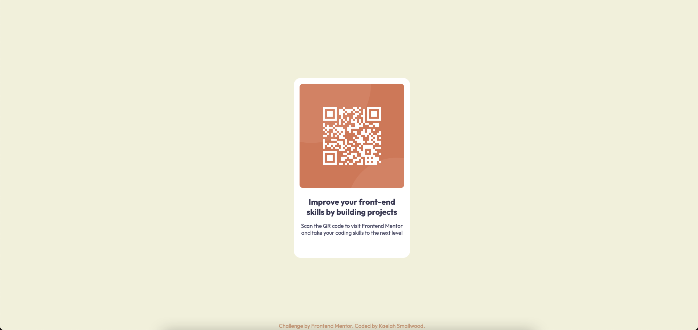

# Frontend Mentor - QR code component solution

This is a solution to the [QR code component challenge on Frontend Mentor](https://www.frontendmentor.io/challenges/qr-code-component-iux_sIO_H). Frontend Mentor challenges help you improve your coding skills by building realistic projects. 

## Table of contents

- [Overview](#overview)
  - [Screenshot](#screenshot)
  - [Links](#links)
- [My process](#my-process)
  - [Built with](#built-with)
  - [What I learned](#what-i-learned)
  - [Continued development](#continued-development)
  - [Useful resources](#useful-resources)
- [Author](#author)

## Overview

### Screenshot

### Links

- Solution URL: [Add solution URL here](https://your-solution-url.com)
- Live Site URL: 

## My process

### Built with

- HTML5 markup
- CSS
- Flexbox

### What I learned

I mainly completed this challenge to see if I still remembered HTML & CSS. I took a break from learning for two months and everything was a little fuzzy, but I find it pretty cool that I remembered most of it. My main issue was using flexbox cause that was a pretty new concept to me, but after playing around with it I got it. 

### Continued development

I don't really have much plans for continued development other than making it more mobile friendly. 

### Useful resources

- [Flexbox Zombies](https://mastery.games/flexboxzombies/) - Helped me relearn flexbox! It was actually pretty fun.

## Author

- Frontend Mentor - [@ItsKatato](https://www.frontendmentor.io/profile/ItsKatato)
- Twitter - [@KaelahDai](https://twitter.com/KaelahDai)
